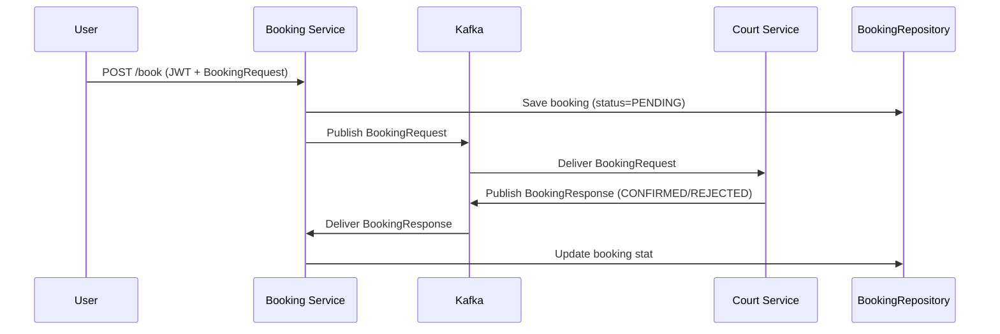

# Booking Service

The **Booking Service** is a Spring Boot microservice responsible for managing **court bookings**.
It acts as the **orchestrator** between users and the **Court Service** using **Kafka messaging** for asynchronous booking confirmation.

The service also enforces **JWT authentication** and **role-based access control**.

---

## Features

* **Create Booking**:

  * Generates a unique booking ID
  * Persists booking with status `PENDING`
  * Publishes booking request to Kafka (`booking-requests`)
* **Consume Booking Responses**:

  * Updates booking status to `CONFIRMED` or `REJECTED`
* **JWT authentication & authorization**:

  * Admin and Customer roles supported
* **Kafka Consumer/Producer integration**
* **Database persistence** with PostgreSQL

---

## Tech Stack

* **Java**: 17+
* **Spring Boot**: 3.x
* **Spring Security + JWT**
* **Spring Data JPA** with PostgreSQL
* **Spring Kafka** (Producer + Consumer)
* **Eureka Client** for service discovery
* **Maven** for build & dependency management

---

## Getting Started

### Prerequisites

Make sure you have installed:

* Java JDK 17+
* Maven 3.8+
* PostgreSQL 14+
* Apache Kafka + Zookeeper
* Eureka Service Registry running on port `8761`
* Court Service running

### Database Setup

Create a database in PostgreSQL:

```sql
CREATE DATABASE BookingsDatabase;
```

Update `application.properties`:

```properties
spring.datasource.url=jdbc:postgresql://localhost:5432/BookingsDatabase
spring.datasource.username=postgres
spring.datasource.password=your_password
```

### Run Locally

```bash
mvn clean install
mvn spring-boot:run
```

Service runs at:
👉 [http://localhost:8086](http://localhost:8086)

---

## Security & Roles

* **Admin**:

  * Create bookings
  * Delete bookings (if extended)
* **Customer**:

  * Create bookings
  * View booking details (future extension)
* All endpoints require JWT authentication.

---

## API Endpoints

### Booking

* **Create Booking**

  ```http
  POST /book
  ```

  **Request Body:**

  ```json
  {
    "arenaId": 1,
    "courtId": 101,
    "date": "2025-09-02",
    "timeSlot": "10:00-11:00"
  }
  ```

  **Response:**

  ```json
  {
    "bookingId": "8b9a23d1-cc93-4fd9-9fa5-1023a9f88329",
    "userName": "customer@example.com",
    "arenaId": 1,
    "courtId": 101,
    "date": "2025-09-02",
    "timeSlot": "10:00-11:00",
    "status": "PENDING"
  }
  ```

---

## Kafka Messaging

### Topics

* **booking-requests** (Producer)
* **booking-responses** (Consumer)

### Booking Flow

1. **Booking Service** receives booking request from user.
2. Persists booking in DB with status `PENDING`.
3. Publishes request to `booking-requests`.
4. **Court Service** processes the request:

   * If available → responds `CONFIRMED`
   * If unavailable → responds `REJECTED`
5. **Booking Service** consumes response and updates booking status in DB.

---

## Architecture Flow (Sequence Diagram)


